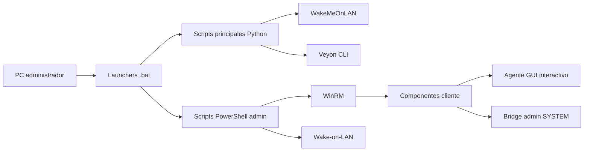
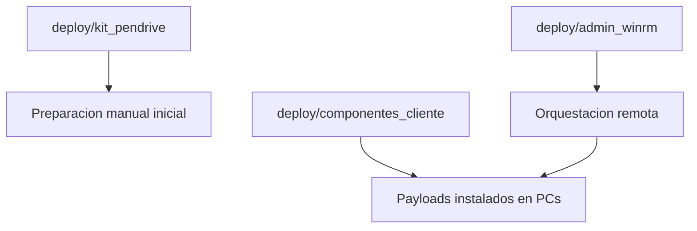
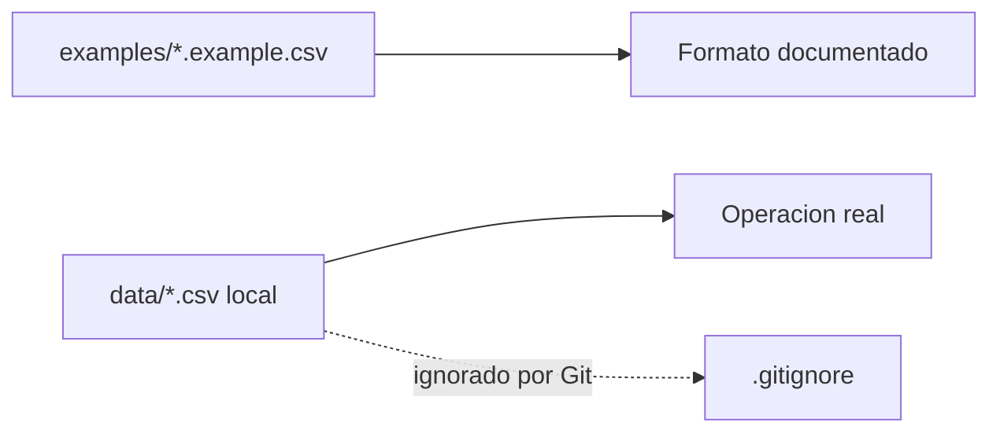

# Arquitectura

Castel LabOps esta pensado como una suite local para el PC administrador. No es un servicio central ni una aplicacion web: ejecuta herramientas Windows y coordina equipos de laboratorio usando Veyon, Wake-on-LAN, WinRM y scripts de soporte.

## Vista general

## Capas

### Launchers

Los `.bat` de la raiz existen por compatibilidad con accesos directos de escritorio. Delegan a `launchers/`, donde esta la logica de elevacion y seleccion de Python/PowerShell.

### Scripts principales

`scripts/principales/` contiene el flujo diario:

- `VEYON_MAESTRO.py`: escanea, filtra clientes Veyon y actualiza ubicaciones.
- `MAPEO_FISICO_ADMIN.py`: mantiene mapeo fisico por MAC.
- `WINRM_MAESTRO.py`: automatizacion remota clave local.

### Deploy

`deploy/` separa lo que se ejecuta desde el administrador de lo que se copia al cliente.

### Datos locales

Los datos reales no forman parte del codigo fuente. El repo solo documenta formato y ejemplo sanitizado.

## Reglas de ubicacion

El maestro de Veyon asigna una ubicacion por defecto (`SalaComputacion`) y aplica overrides por MAC cuando un equipo pertenece a una sala de curso. La IP no se usa como regla permanente porque cambia por DHCP.

Orden de resolucion:

1. MAC detectada.
2. Ubicacion por defecto.

Los nombres visibles tambien pueden cambiar por MAC. Por ejemplo, los equipos de curso se publican como `6B` y `4MB`, dentro de las ubicaciones agrupadoras `SalasBasica` y `SalasMedia`.
